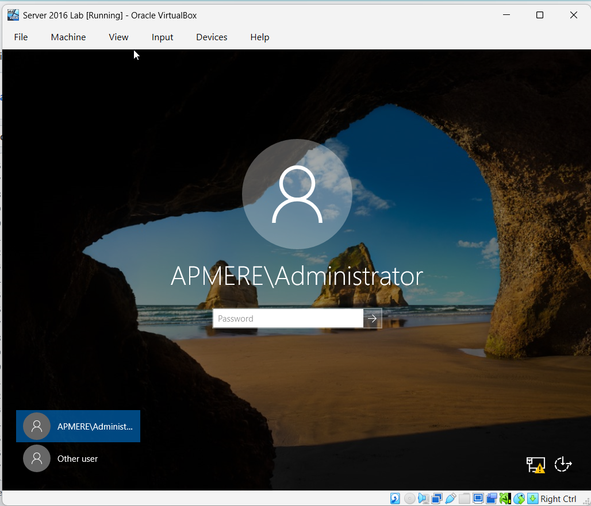

# Installing Active Directory Domain Services

## Objective
Install Active Directory and configure Windows Server as a Domain Controller.

## Step 1: Add AD DS Role

Installed Active Directory Domain Services role.

Screenshot:

---

## Step 2: Promote to Domain Controller

Created new domain:

armandt.local

Screenshot:

---

## Step 3: Login to Domain

Logged into domain controller successfully.

Screenshot:

---

## Step 4: Open Active Directory

Opened Active Directory Users and Computers.

Screenshot:

---

## Result

Active Directory installed successfully and domain controller operational.

---

## Skills Learned

- Installing Active Directory
- Configuring Domain Controller
- Creating domain environment
- Windows Server administration
